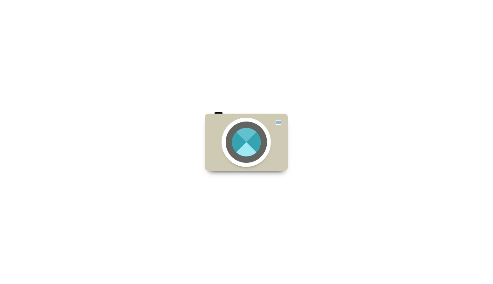

# CSS3 Drawing Course

## About

Challenges from a course based in drawings made with CSS. This course was a lot of fun, it was a great opportunity to practice positioning, pseudo-elements and BEM and to have a new perspective of what it's possible only with the power of HTML5 and CSS3.

## Index

1. Adidas logo
2. Batman
3. Beaver
4. Brackets logo
5. Camera
6. Captain America Shield
7. Coffe mug
8. Diamond
9. Donut
10. Envelope
11. Figma logo
12. Gear
13. Git logo
14. Google logo
15. Homer Simpson
16. Instagram Logo
17. LG logo
18. Angry Panda
19. Pepsi logo
20. React logo
21. Shelf
22. Watermelon

### 1. Adidas logo

### 2. Batman

### 3. Beaver

### 4. Brackets logo

### 5. Camera

### 6. Captain America Shield

### 7. Coffe mug

### 8. Diamond

### 9. Donut

### 10. Envelope

### 11. Figma logo

### 12. Gear

### 13. Git logo

### 14. Google logo

### 15. Homer Simpson

### 16. Instagram Logo

### 17. LG logo

### 18. Angry Panda

### 19. Pepsi logo

### 20. React logo

### 21. Shelf

### 22. Watermelon

